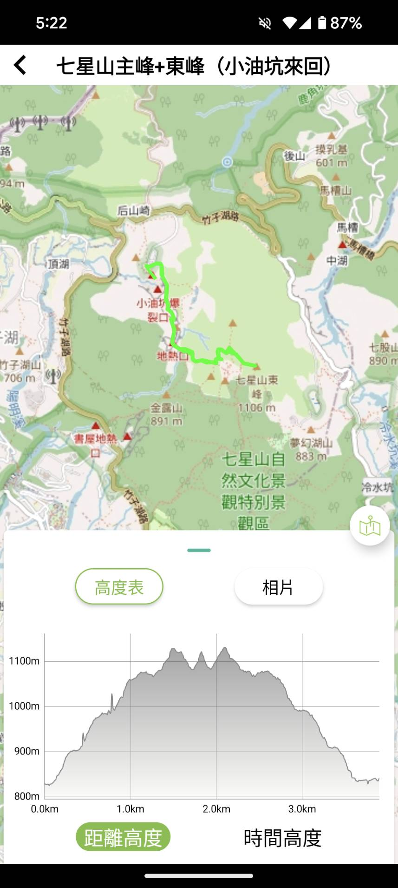

## 簡介

由於生長在台北多年還沒去七星山主峰的三角點，趁著難得的好天氣出遊踩點

這次爬七星山的主要路線是從 **小油坑登山口** -> **七星山主峰** -> **七星山東峰**，接著原路返回到 **小油坑停車場**

> 路線: 

七星山是台北市內最高的山，海拔達到 `1120` 公尺

## 小油坑地熱口

地熱口附近硫磺味很重，但天氣冷其實靠近挺暖的

湧出的硫磺泉會沸騰冒泡

